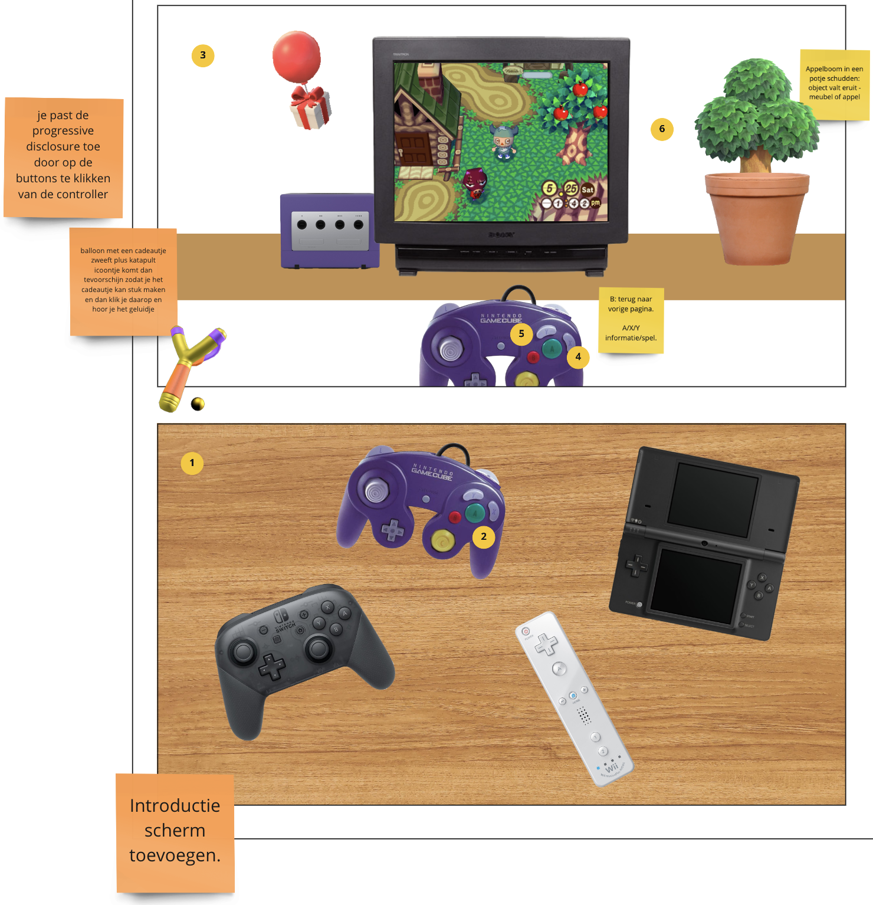
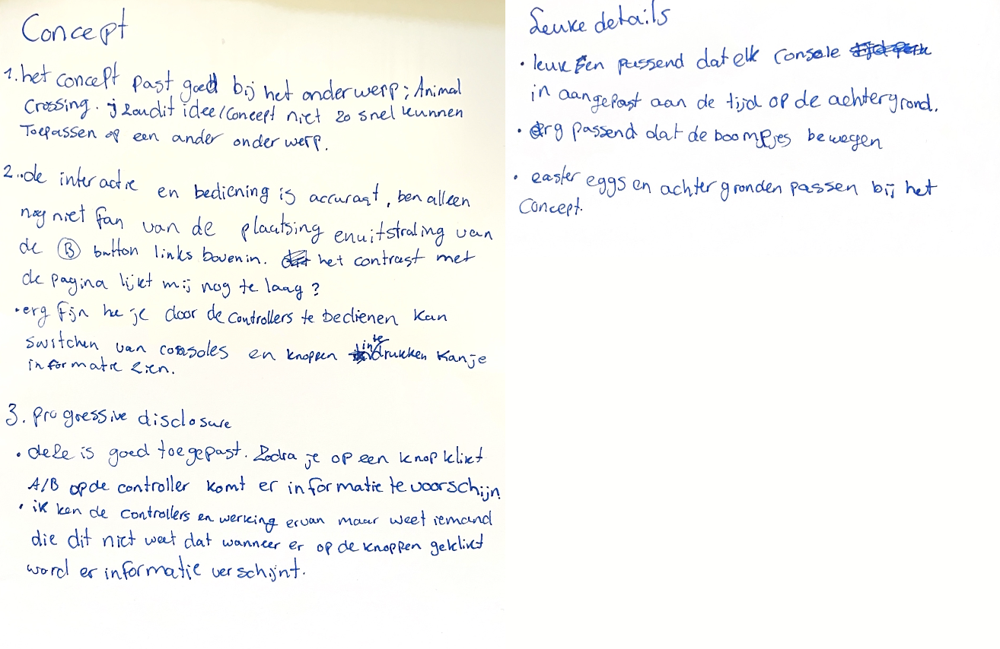
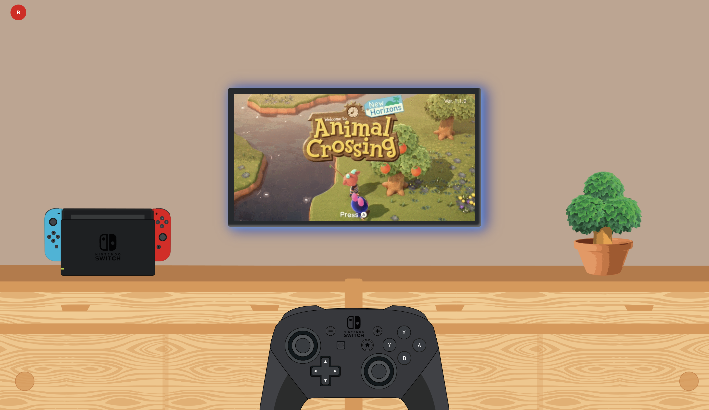
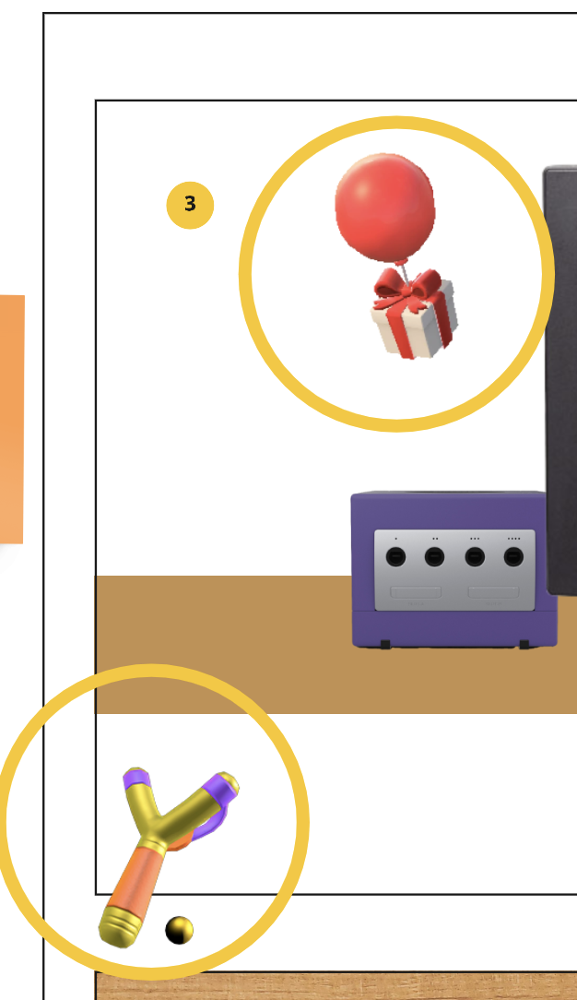

# Procesverslag
Markdown is een simpele manier om HTML te schrijven.  
Markdown cheat cheet: [Hulp bij het schrijven van Markdown](https://github.com/adam-p/markdown-here/wiki/Markdown-Cheatsheet).

Nb. De standaardstructuur en de spartaanse opmaak van de README.md zijn helemaal prima. Het gaat om de inhoud van je procesverslag. Besteedt de tijd voor pracht en praal aan je website.

Nb. Door *open* toe te voegen aan een *details* element kun je deze standaard open zetten. Fijn om dat steeds voor de relevante stuk(ken) te doen.

## Jij

### Ontwerper:
Ellen Bloemhof

#### Je startniveau:
Mijn startniveau is: blauw.
Ik begrijp wel de css-properties waar wij mee werken maar ik vind het erg lastig wanneer je welke inzet. Ik weet vaak wat ik wil maar het moeite met hoe ik dit zou moeten uitwerken. Ik heb af en toe een setje in de goede richting nodig.

# Je plan

  
De eerste versie/schets van je ontwerp & je persoonlijke uitdaging

  ### De eerste versie/schets:
  Ik heb gekozen voor de opdracht tijdlijn en een eigen onderwerp daarbij gekozen, namelijk Animal Crossing. 
  Animal Crossing is een levenssimulatiespel dat voor het eerst is uitgebracht in 2001 en telt anno 2022 tien games. Ik heb ervoor gekozen om vier games uit te kiezen waar de meeste verschillen tussen zaten. 
  
  

  Mijn tijdlijn is vormgegeven in een huiselijke setting. Als je de webpagina opent zie je controllers van verschillende consoles liggen op tafel. Het idee is dat als de gebruiker een controller selecteert/oppakt het beeld verschuift richting een televisie, waarop je de game ziet en informatie, in de setting van het uitgegeven jaar.

  ### Je ambitie: 
  Aan deze technieken/punten wil ik werken:
  - responsive design;
  - grid onder de knie krijgen;
  - over het algemeen: technische kennis op doen voor in de toekomst zodat ik goed kan samenwerken met developers.

## Voortgang/Feedback 1

  
Mijn bevindingen + wijzigingen

Ik heb dinsdag 10 mei samen met Mirte gekeken naar mijn concept.

  ### Bevinding 1:
  Mijn concept was niet specifiek gericht op mijn onderwerp, Animal Crossing, en kon worden toegepast op andere onderwerpen. Wij hebben samen gekeken naar hoe wij het meer kunnen toepassen op mijn onderwerp.

  #### oplossing:
  De sfeer van het geheel moet worden aangepast. Steeds als je een game selecteert door op de controller te klikken dan wordt de achtergrond aangepast naar het specifieke jaar dat de game is uitgekomen met kleine elementen die echt gericht zijn op de game.

  ### Bevinding 2:
  Ik had nog geen eastereggs, daar had ik moeite mee. Wij hebben hier met z'n tweetjes hierover gebrainstormt.

  #### oplossing:
  **Eerste element vanuit de game:** Ergens onderin op de pagina komt een katapult tevoorschijn en als deze omhoog komt zal er een ballonnetje met een kadootje door het beeld zweven - als je de katapult selecteert knapt deze kapot. 

  **Tweede element vanuit de game:** Als je in de game aan bomen schud valt er fruit of een blaadje naar beneden. Dat ook toepassen in mijn ontwerp door click of hover toe te voegen waardoor het boompje schud en een element naar beneden valt.

  ### Bevinding 3:
  Er moet meer gebeuren met de controllers in het begin, in mijn concept hebben ze tot nu toe alleen nog maar de functie om te navigeren naar het jaar. 

  #### oplossing:
  Gaan spelen met hover op de elementen, als de bezoeker er overheen hovert de controler laten bewegen en/of het geluid afspelen van de spelcomputer.

  ### Feedback op Miro en aanpassingen in beeld:
  

## Voortgang/Feedback 2

  
Mijn bevindingen + wijzigingen

  Maandag 16 mei heb ik samen met Tamar gekeken naar mijn ontwerp.

  ### Bevinding 1:
  Het eerste wat mij meteen opviel is dat positioneren is nog niet helemaal goed gegaan, mijn ontwerp zag er anders uit op haar beeldscherm dan bij mij, doordat haar scherm veel kleiner was dan de mijne.

  #### oplossing:
  Aantekening gemaakt hiervan en Sanne om hulp gevraagd, omdat ik moeite heb met positioneren. Uiteindelijk bleek dat ik elementen niet op de juiste plek geplaatst waardoor uitlijnen niet lukte. Hij heeft dit voor mij opgelost.

## Voortgang/Feedback 3

  
Mijn bevindingen + wijzigingen

  Woensdag 18 mei heb ik samen met Mirte de laatste feedback ronde gedaan.

  ### Bevinding 1:
  Mirte is geen fan van de plaatsing en styling van mijn B-button bovenin. Ik heb 'm nu vormgegeven als een B-button zoals ze eruit zien op de consoles.

  #### oplossing:
  Stijling hiervan aanpassen zodat hij meer opvalt.

  

## Reflectie

  
Mijn eindresultaat & persoonlijke ontwikkeling

  ### Je uitkomst - karakteristiek screenshot(s):
  

  ### Dit ging goed/Heb ik geleerd: 
  - Wat ikzelf fijn vond om te leren was dat je gemakkelijk in een keer alle kleuren kan aanpassen door het in de root te plaatsen, ik had daar nog niet eerder van gehoord. 
  - Ook heb ik geleerd hoe je onderdelen van positioneren door gebruik te maken van grid. 
  - Ook begrijp ik nu position relative en absolute beter, deze twee properties hadden mij erg afgeschrikt in het eerste leerjaar en daardoor durfde ik ze nooit toe te passen.
  - dat je een startscherm kan toevoegen aan je website.
  - JavaScript is minder eng.

  - Ik heb trouwens wel echt geleerd, dit is misschien nog het meest belangrijkste, dat het echt heel belangrijk is dat je ook met andere mensen gaat zitten om te werken hieraan. Het is fijn om hulp en feedback tussendoor te vragen en ook om je aanpak te valideren.

  

  ### Dit was lastig/Is niet gelukt:
  - Ik heb moeite met elementen aanduiden in de stylesheet. Mijn hoofd krijgt een storing zodra elementen dubbel zijn en daardoor heb ik classes gebruikt; waardoor ik veel onnodige classes heb gebruikt wat niet nodig zou zijn geweest. Dit is iets waar ik mij meer in zou moeten verdiepen om het op de juiste manier te doen.

  - Ik had meer willen opleveren dan er tijd voor was en heb daardoor dingen moeten laten vallen. Ik had gepland om meerdere easter eggs te maken die gericht zijn op de game zoals de katapult maar dit heb ik niet kunnen uitwerken. Ik vond positioneren erg lastig waardoor ik beter daar mijn tijd aan kon spenderen dan de leuke extra's. 

  Ik ben mijzelf wel ontzettend tegengekomen bij dit vak, de emotionele rollercoaster heb ik inmiddels wel elf keer doorlopen. 
  

## Bronnenlijst

Welke bronnen heb ik de afgelopen twee weken gebruikt?

1. Sanne 't Hooft, CodePen, uitleg positioneren en door pagina's scrollen: https://codepen.io/shooft/pen/XWZdGbq?editors=1100
2. Sanne 't Hooft, geforkte CodePen, animaties - springen maar: https://codepen.io/ellenbloemhof/pen/OJQNJWW
3. Sanne 't Hooft, CodePen, klikken - swap image: https://codepen.io/shooft/pen/mdpoYve
4. Schudden onder animeren: wobble-hor-top, https://animista.net/play/attention/wobble/wobble-hor-top
5. Schudden boven animeren, wobble-hor-bottom, https://animista.net/play/attention/wobble/wobble-hor-bottom

### Bronnen gifjes/tekst:

1. Animal Crossing, logo, https://logos-world.net/animal-crossing-logo/
2. Favicon: https://www.logolynx.com/topic/animal+crossing#&gid=1&pid=6
3. GameCube gif: Animal Crossing - GameCube Intro HD, https://youtu.be/ij_Z__adPMY
4. GameCube tekst: Animal Crossing (videogame), https://en.wikipedia.org/wiki/Animal_Crossing_(video_game)
5. Nintendo DS gif: Animal Crossing: Wild World - Nintendo DS Gameplay High Resolution (DeSmuME),https://youtu.be/ArcR_dGhn9U
6. Nintendo DS tekst: Animal Crossing: Wild World, https://nl.wikipedia.org/wiki/Animal_Crossing:_Wild_World
7. Nintendo Wii gif: Let's Play: Animal Crossing-City Folk (part 1) "Setting Out", https://youtu.be/2FnzxkeKJSA
8. Nintendo Wii tekst: Animal Crossing: Let's go to the city, https://nl.wikipedia.org/wiki/Animal_Crossing:_Let%27s_Go_to_the_City
9. Nintendo Switch gif: Animal Crossing: New Horizons - Gameplay Walkthrough Part 1 - First Day on a New Island!, https://youtu.be/qui_P7672OA
10. Nintendo Switch tekst: Animal Crossing: New Horizons, https://nl.wikipedia.org/wiki/Animal_Crossing:_New_Horizons

